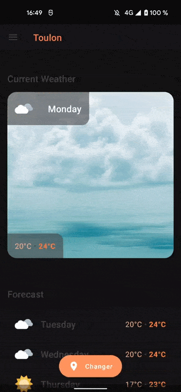

# Weather

Simple weather demonstration app using Jetpack Compose.

## Showcase

#### Light and dark themes

## Architecture

I tried to implement clean architecture as I usually do it in application development.

### Features

##### Home

> This is the main feature of the app. It contains the home screen with the weather data displayed to the user.

##### Credits

> This is a simple screen to showcase the navigation between activities and show the developer's ownership.

### Core modules

##### Data

> This module is responsible for data access. In this project, it uses OpenWeather API to get JSON content.

##### Domain

> It contains models describing our business.

##### Interactors

> This module is one of the most important as it connects the data to the domain. It provides mappers to create domain objects from multiple data entities.

>Is also holds the repositories instances.

##### Navigation

> This modules is accessed by the features to navigate between modules. It uses [Router](https://github.com/chargemap/android-router) to provide navigation between activities / fragments.
	
##### Presentation

> The presentation module contains common UI code such as reusable Composable components.

##### Testing

> Common testing module to reduce boilerplate

## Stack

* [Kotlin](https://kotlinlang.org/) for development language
* [Koin](https://insert-koin.io/) for dependency injection
* [Moshi](https://github.com/square/moshi) for JSON
* [Retrofit](https://github.com/square/retrofit) for HTTP calls
* [Flow](https://developer.android.com/kotlin/flow) for observable variables
* [Coroutines](https://kotlinlang.org/docs/coroutines-overview.html) for asynchronous coding
* [Jetpack Compose](https://developer.android.com/jetpack/compose) for user interfaces
* [Router](https://github.com/chargemap/android-router) for navigation
* [Klock](https://github.com/korlibs/klock) for easier datetime management
* [JUnit5](https://junit.org/junit5/docs/current/user-guide/) for testing

## Testing

Unit testing has been done for each module to ensure critical parts are working as expected.

## Contributors

|  | [Raphaël Bertin](https://github.com/r4phab) |
|:------------------------------------------------------------------------------:|--------------|
